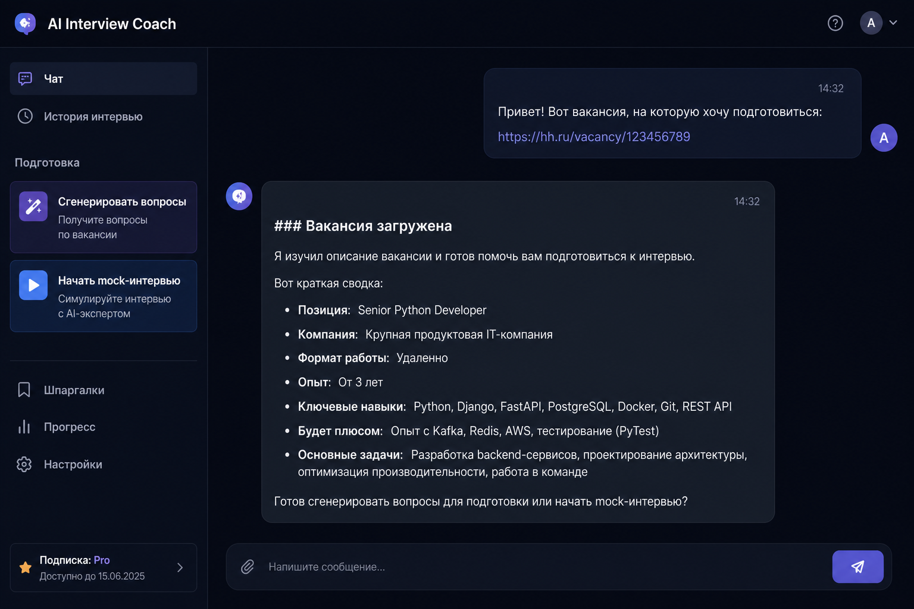

# AI Interview Coach

**AI Interview Coach** — веб-приложение для подготовки к собеседованию: разбор вакансии (hh.ru или текст), генерация вопросов, пошаговая оценка ответов и mock-интервью в чате со стримингом ответа.

## Скриншот



## Live-версия

- **Приложение (frontend):** http://13.60.91.191  
- **Проверка API:** http://13.60.91.191/api/health  

## Локальный запуск (Docker Compose)

Один запуск поднимает **backend**, **frontend**, **Qdrant** и **Nginx** (прокси на порту 80).

```bash
git clone https://github.com/Alenik007/project-26-capstone.git
cd project-26-capstone
cp .env.example .env
# Укажите OPENAI_API_KEY и при необходимости остальные переменные в .env
docker compose up --build
```

После старта контейнеров:

- **Интерфейс:** http://localhost/ (через Nginx)  
- **Health API:** http://localhost/api/health  

> На Windows порт **80** может быть занят или требовать прав администратора — в этом случае измените проброс порта в `docker-compose.yml` (например `"8080:80"`) и откройте http://localhost:8080/.

## Структура проекта

| Путь | Назначение |
|------|------------|
| `backend/` | FastAPI-приложение: агент (LangGraph), инструменты (парсер hh, генерация вопросов, feedback), RAG, rate limit, защита от prompt injection |
| `frontend/` | Next.js (React): чат со SSE, боковая панель быстрых действий, сохранение сессии в `localStorage` |
| `nginx/` | Конфиг reverse proxy: `/` → frontend, `/api/` → backend |
| `data/` | Исходные материалы для базы знаний (markdown) и скрипты индексации в Qdrant |
| `docs/` | Доп. документация (например деплой), скриншот для README |
| `docker-compose.yml` | Сборка и оркестрация всех сервисов |
| `.github/workflows/` | CI: тесты backend, линт frontend |

## Технологии

- **Backend:** Python 3.11+, FastAPI, Uvicorn, LangChain / LangGraph, OpenAI API, Qdrant (векторное хранилище), SlowAPI (rate limiting), httpx  
- **Frontend:** Next.js 15, React 19, TypeScript  
- **Инфраструктура:** Docker, Docker Compose, Nginx; пример деплоя — AWS EC2 + Ubuntu  
- **CI:** GitHub Actions  
- **Опционально:** LangSmith (переменные в `.env.example`)

## API (эндпоинты)

Базовый путь на сервере за Nginx: префикс **`/api`**, далее путь FastAPI без дублирования (прокси снимает префикс). Локально в контейнере backend слушает `:8000`.

### `GET /health`

Проверка работоспособности сервиса.

**Ответ:** `200 OK`, тело JSON:

```json
{ "status": "ok" }
```

### `POST /chat`

Диалог с агентом; ответ — **поток SSE** (Server-Sent Events).

**Тело запроса (JSON):**

| Поле | Тип | Описание |
|------|-----|----------|
| `session_id` | string | Идентификатор сессии (например UUID) |
| `message` | string | Текст пользователя |

**Пример:**

```json
{
  "session_id": "demo-session",
  "message": "Вот ссылка на вакансию: https://hh.ru/vacancy/123456"
}
```

**Ответ:** `text/event-stream`. Каждый ответ ассистента — один SSE-кадр: несколько строк `data: <строка текста>` подряд, пустая строка завершает кадр (переносы в тексте не теряются). Завершение: кадр с `data: [DONE]`.

**Ошибки:** `400` при обнаружении prompt injection в сообщении; лимит запросов — **20 запросов в минуту с одного IP** (настраивается).

### `GET /sessions/{session_id}`

Возвращает сохранённую историю сообщений сессии (упрощённое in-memory хранилище на стороне backend).

**Ответ:** JSON с полями `session_id` и `messages` (массив объектов `role` / `content`).

## Переменные окружения

См. **`.env.example`**: `OPENAI_API_KEY`, `OPENAI_MODEL`, `QDRANT_URL`, `QDRANT_COLLECTION`, CORS, лимиты, LangSmith и др.

## Тесты (backend)

```bash
cd backend
pytest
```

## Deployment (AWS EC2 + Nginx)

Обновление кода на сервере: **[docs/git-deploy.md](docs/git-deploy.md)**.

Кратко:

```bash
ssh -i <ваш-ключ.pem> ubuntu@13.60.91.191
cd /home/ubuntu/project-26-capstone
git pull origin main
cp -n .env.example .env   # если .env ещё нет
nano .env                 # OPENAI_API_KEY и др.
docker compose up --build -d
```

Проксирование HTTP внутри стека делает контейнер **nginx** (конфиг в каталоге `nginx/`). При необходимости перед ним можно поставить отдельный Nginx на хосте (TLS, дополнительные правила) — это вне текущего `docker-compose.yml`.

## Известные ограничения

- Парсинг вакансий с hh.ru может быть нестабилен при изменениях сайта или ограничениях по IP.  
- Качество обратной связи зависит от полноты описания вакансии и от выбранной модели OpenAI.  
- RAG ограничен подготовленными документами в `data/` и настройкой коллекции Qdrant.  
- История сессии на backend **в памяти** — после перезапуска процесса сбрасывается (на фронте дублируется в `localStorage`).  
- Нет регистрации пользователей и разграничения доступа.  
- В `docker-compose.yml` для frontend может быть задан `NEXT_PUBLIC_API_URL` под конкретный хост деплоя; для чисто локальной работы убедитесь, что клиент ходит на тот же origin, что и UI (см. `frontend/lib/api.ts`).

## План развития

- Авторизация и личные кабинеты.  
- Персистентное хранение сессий и отчётов (PostgreSQL или аналог).  
- Экспорт итогового отчёта в PDF.  
- Поддержка других площадок вакансий (LinkedIn и др.).  
- Голосовой режим mock-интервью.  
- Аналитика прогресса и сравнение проходов.  
- Расширение и актуализация базы знаний для RAG.

## Возможности продукта

- Разбор вакансии по ссылке hh.ru (API и fallback на HTML) или по вставленному тексту.  
- Генерация вопросов под вакансию, режим практики с оценкой каждого ответа и mock-интервью.  
- Стриминг ответов (SSE), RAG по базе знаний, защита от prompt injection, rate limiting.
